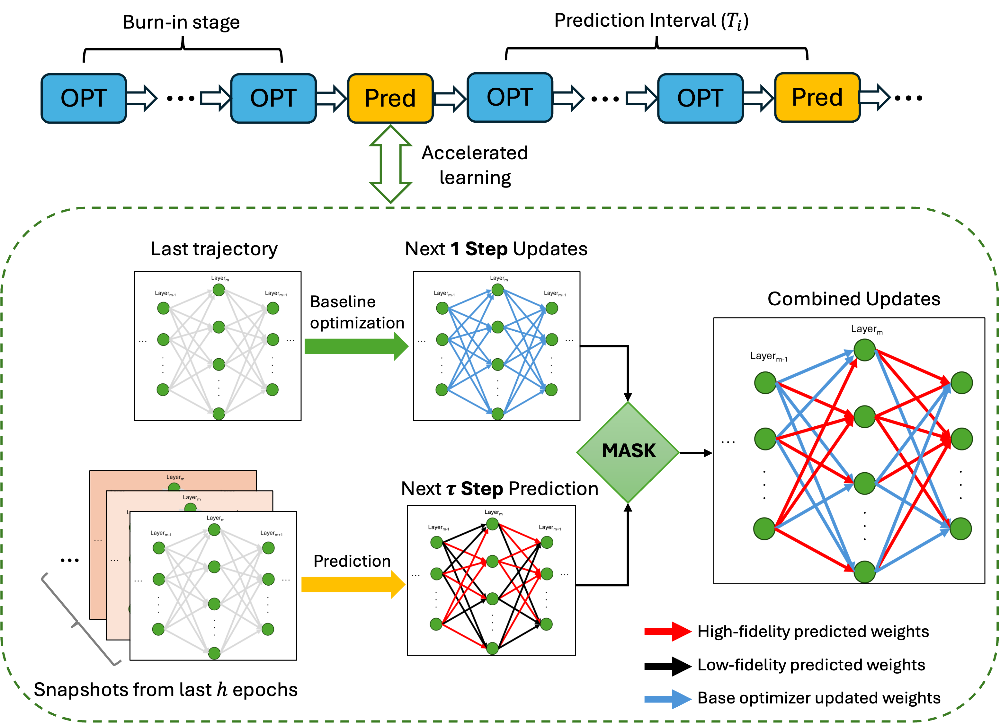

# PDT: Predictive Differential Training Guided by Training Dynamics

Official implementation of the ICLR 2026 paper
[*Predictive Differential Training Guided by Training Dynamics*](https://openreview.net/forum?id=zSTgrLkpRi)
by Fanqi Wang\*, Weisheng Tang\*, Landon Harris, Hairong Qi, Dan Wilson and Igor Mezić
(\* equal contribution).

<p align="center"></p>

Training a neural network is a discrete dynamical system on the weight space. PDT fits a
dynamic mode decomposition (DMD) to the last few epoch-level weight snapshots, predicts
the weights a few epochs ahead, and keeps only the predictions that are consistent with
the local optimizer dynamics. The accepted coordinates jump ahead, the remaining ones keep
their optimizer update. PDT is a plug-in on top of any optimizer (SGD, Adam, AdamW,
RMSprop, Shampoo, LAMB, ...) and acts once per epoch, so its overhead is small.

## Contents

| Path | What it is |
|---|---|
| `kcl/lib/trainers/pdt_trainer.py` | PDT, single GPU (`--trainer pdt`) |
| `kcl/lib/trainers/pdt_distributed_trainer.py` | PDT for DistributedDataParallel training, with the acceleration scheduler (`--trainer pdt_distributed`) |
| `kcl/lib/trainers/pdt_layerwise_trainer.py` | PDT-Layerwise: one DMD per layer group, used for ViT-Huge (`--trainer pdt_layerwise`) |
| `kcl/lib/trainers/baselines.py` | non-selective prediction, random acceleration, random mask, switching on validation loss |
| `kcl/lib/trainers/trainer_base.py` | the baseline trainer (plain optimizer), training loop, evaluation, logging, profiling |
| `kcl/lib/trainers/ssl_trainer_base.py`, `simsiam_*.py` | SimSiam self-supervised training with and without PDT |
| `kcl/lib/dmd/` | DMD in PyTorch (`TorchDMD.fit`, `TorchDMD.predict_multistep`) |
| `kcl/lib/models/`, `kcl/lib/datasets/` | FC networks, FCN, AlexNet, LSTM, SimSiam; CIFAR-10, ImageNet, AG News loaders |
| `scripts/train.py`, `scripts/train_ssl.py` | entry points |
| `scripts/cifar10/`, `scripts/imagenet/`, `scripts/ssl/`, `scripts/nlp/` | experiment configurations of the paper, see [`EXPERIMENTS.md`](EXPERIMENTS.md) |
| `tests/` | DMD unit test and an end-to-end smoke test |

The package is named `kcl` for historical reasons.

## Installation

```bash
git clone https://github.com/aicip/PDT.git
cd PDT
conda create -n pdt python=3.9 -y && conda activate pdt
pip install torch==2.0.0 torchvision==0.15.0 --index-url https://download.pytorch.org/whl/cu118
pip install -e .
```

`requirements.txt` pins the versions used for the single-GPU experiments (Python 3.9,
torch 2.0.0, CUDA 11.8); the ImageNet experiments ran with torch 2.1.2 / CUDA 12.1. The
code is tested with these two versions; newer PyTorch releases may work but are not
tested.
`torch-optimizer` is only needed for Shampoo and LAMB, `datasets` for AG News and
`scikit-learn` for the SimSiam linear probe.

## Data

* **CIFAR-10** is downloaded automatically into `--data_dir` (default `data/`).
* **ImageNet-1k** is expected in the ImageFolder layout `<data_dir>/train/<class>/*.JPEG`
  and `<data_dir>/val/<class>/*.JPEG`.
* **AG News** is downloaded through HuggingFace `datasets` (cached in `~/.cache/huggingface`).

## Quick start

Baseline and PDT for AlexNet on CIFAR-10 (the setting of Figure 4 of the paper, about
15 minutes each on one RTX A6000):

```bash
export DATA_DIR=data
bash scripts/cifar10/alexnet_baseline.sh   # SGD, lr 0.05, cosine schedule, 60 epochs
bash scripts/cifar10/alexnet_pdt.sh        # the same run with PDT
```

which is equivalent to

```bash
python scripts/train.py --dataset cifar10 --data_dir data --model alexnet --optimizer sgd --lr 0.05 \
    --train_batch_size 256 --train_epochs 60 --cosine_lr_sched --lr_min 1e-3 \
    --trainer pdt --predict_start_epoch 5 --predict_epoch_interval 1 --predicted_num 5 --n_past_weights 5 \
    --log_dir logs/cifar10/alexnet_pdt_seed0
```

Every run writes `<log_dir>/metrics.csv` with one row per epoch (training loss, test loss,
accuracy, learning rate, epoch time, elapsed wall-clock time, and for PDT whether a
prediction was made and the fraction of accepted predictions). The console shows the same
metrics per epoch, plus the fraction of accepted predictions in every prediction epoch:

```
Epoch 0004 | train loss 1.8202 | test loss 1.7480 | accuracy 0.3245 | lr 4.92e-02 | 12.5s
Epoch 0005 | accepted predictions: 23.03% of 57044810 parameters
Epoch 0005 | train loss 1.6944 | test loss 1.6995 | accuracy 0.3820 | lr 4.88e-02 | 13.1s
...
Epoch 0059 | accepted predictions: 14.69% of 57044810 parameters
Epoch 0059 | train loss 0.0005 | test loss 2.0124 | accuracy 0.7864 | lr 1.00e-03 | 13.1s
Final test loss: 2.0124
Final train loss: 0.0005
Final accuracy: 0.7864
Per-epoch metrics written to logs/cifar10/alexnet_pdt_seed0/metrics.csv
```

These lines come from one run of the released code (seed 0, one RTX A6000 shared with
other jobs). In that run the baseline finished with accuracy 0.790 and a best training
loss of 0.0019 after 949 s; PDT accepted between 14% and 26% of the predicted
coordinates per prediction epoch, reached the baseline's best training loss at epoch 35
(596 s) and finished with accuracy 0.786. Single-seed numbers like these vary from run to
run and across hardware.

To check the installation, run the unit test and the smoke test (all trainers, a few
short epochs on CIFAR-10, a few minutes on one GPU):

```bash
python tests/test_dmd.py
DATA_DIR=data bash tests/test_smoke.sh
```

The smoke test verifies that data loads, that every trainer completes, that the
prediction step is triggered and that the losses stay finite. Accuracies and wall-clock
times of full runs vary with the hardware and the software versions; the numbers in the
paper are not an acceptance criterion.

### Main options of `scripts/train.py`

| Option | Meaning |
|---|---|
| `--trainer` | `base`, `pdt`, `pdt_distributed`, `pdt_layerwise`, `nonselective`, `random_accelerated`, `random_mask`, `switch_by_loss` |
| `--predicted_num` | `tau`: number of steps predicted ahead (default 5) |
| `--predict_epoch_interval` | `T_i`: epochs between two predictions (default 1) |
| `--predict_start_epoch` | `T_0`: first epoch with a prediction (default 5) |
| `--n_past_weights` | `h`: number of past epoch snapshots used by DMD (default 5) |
| `--svd_rank` | SVD truncation for DMD; 0 (default) uses the optimal hard threshold of Gavish and Donoho |
| `--mask_mode` | `both` (PDT), `accel_only`, `consistency_only` (ablation of the two masking criteria) |
| `--save_masks` | write the boolean mask of every prediction epoch to `<log_dir>/masks/` |
| `--count_flops_fast`, `--profile_memory`, `--profile_timing` | profiling of the PDT overhead (FLOPs, timing, GPU memory), printed per epoch and logged to wandb |
| `--use_wandb`, `--wandb_project`, `--wandb_entity`, `--run_name` | optional Weights & Biases logging |

Run `python scripts/train.py --help` for the full list. Rules of thumb from the paper:
`h = 5` and `tau = 5` are robust defaults; increase `tau` to 7 for very smooth training
curves, reduce it to 3 if training becomes unstable; keep `T_i = 1` unless training is
unstable; `T_0` should be at least `h`.

## Multi-GPU training

The distributed trainers run one process per GPU with DistributedDataParallel. Rank 0
keeps the weight history, fits DMD and computes the mask; the assembled weights are
broadcast to the other ranks.

```bash
export DATA_DIR=/path/to/imagenet
NGPUS=3 bash scripts/imagenet/resnet50_pdt.sh            # torchrun, 600 images per GPU
```

`scripts/imagenet/slurm/train.sbatch` is a SLURM template (`srun`, one task per GPU).
Batch sizes in the ImageNet scripts are per GPU. The ResNet-50 and ViT-Base
configurations use 600 images per GPU on three GPUs (global batch 1800, as in the
paper); the ViT-Huge configuration uses 128 images per GPU with the number of GPUs and
nodes set through `NGPUS` and `NNODES`. `--w_device cuda:N` stores the weight history on
a separate GPU for very large models. For ViT-Huge use `--trainer pdt_layerwise`, which
fits one DMD model per layer group (see `scripts/imagenet/vit_huge_pdt_layerwise.sh`).

## Self-supervised learning and NLP

```bash
bash scripts/ssl/simsiam_pdt.sh          # SimSiam, ResNet-18, CIFAR-10
bash scripts/nlp/ag_news_lstm_pdt.sh     # 4-layer LSTM on AG News
```

## Outputs

* `<log_dir>/metrics.csv`: per-epoch metrics (columns `epoch, train_loss, test_loss,
  accuracy, lr, epoch_time_s, elapsed_s, prediction_epoch, mask_ratio, predicted_num,
  predict_epoch_interval`). [`EXPERIMENTS.md`](EXPERIMENTS.md) explains how the metrics
  of the paper (final accuracy, best training loss, time to baseline best loss / accuracy)
  are computed from it.
* `<log_dir>/final/` (and `<log_dir>/epoch_XXXX/` with `--save_freq N`): model and
  optimizer state and a `meta.pkl` with the loss history and the run configuration.
* `<log_dir>/masks/mask_epoch_XXXX.pt` with `--save_masks`: one boolean per parameter.

## Implementation notes

This release provides cleaned reference implementations and experiment configurations
that correspond to the settings described in the paper; the implementations that produced
the reported results are preserved under the git tag `iclr2026-experiment-code`. The
masking criteria and the DMD prediction are the same as in those implementations,
including the places where they differ from the equations in the paper; those differences
are listed first. The distributed scheduler keeps the historical adjustment rule, with the
synchronisation changes described below. The remaining notes describe engineering
changes made for the release.

* **Acceleration-effectiveness criterion (Eq. 6).** The code uses the upper bound
  `|w_pred - w| <= (tau + 1) |w_sgd - w|` and an inclusive lower bound
  `|w_pred - w| >= |w_sgd - w|` (`PDTTrainer.compute_mask`).
* **Dynamic-consistency criterion (Eq. 7).** The code compares the sign of the final
  predicted displacement `w_pred(tau) - w` with the sign of the optimizer update, rather
  than the sign of every intermediate step.
* **Reference point.** The weight snapshot appended to the history at the start of an
  epoch (`w`) is the reference for both displacements: the optimizer update
  `w_sgd - w` of that epoch, and the DMD prediction `w_pred - w` started from the same
  snapshot. Accepted coordinates take `w_pred`, the others keep `w_sgd`.
* **Prediction (Eq. 12).** `TorchDMD.predict_multistep` returns
  `w + Re{Phi (Lambda^tau - I) Phi^+ w}`, i.e. the predicted displacement is added to the
  current weights so that the reconstruction error of `w` does not enter the prediction.
* **Acceleration scheduler.** The distributed trainers reduce `tau` and/or increase
  `T_i` when the training loss increases from one epoch to the next
  (`PDTDistributedTrainer.adjust_parameters_based_on_loss`); the single-GPU trainer keeps
  `tau` and `T_i` fixed.
* **PDT-Layerwise.** For ViT-Huge the parameters are split into layer groups and each group
  has its own weight history and DMD model (a block-diagonal approximation of the global
  dynamics). This variant was used only for the ViT-Huge experiment. The implementation
  used for that experiment kept an outer `torch.cuda.amp.autocast()` context around the
  whole prediction epoch (optimizer epoch and DMD step). Autocast caches the low-precision
  casts of parameters until the outermost context exits, so inside such an epoch the
  forward passes of autocast-eligible layers reuse casts made before the optimizer
  updates of that epoch. The release scopes autocast to the individual forward passes,
  like every other trainer, so that each batch sees the current weights.
* **Mixed precision.** All trainers train under `torch.autocast(bfloat16)` with a
  `GradScaler`. In the experiments run before November 2025 the single-GPU PDT epoch was
  computed in float32 while the baseline used bfloat16; this had no measurable effect on
  the CIFAR-10 epoch times.
* **Distributed evaluation.** Validation metrics are summed over ranks
  (`all_reduce`); the code used for the ImageNet experiments reported the metrics of the
  shard of rank 0.
* **Scheduler synchronisation.** The acceleration scheduler evaluates its rule on the
  training loss averaged over all ranks, and the schedule state (`tau`, `T_i`) is
  broadcast from rank 0 after every epoch, so all ranks predict in the same epochs. The
  code used for the ImageNet experiments evaluated the rule on each rank's own shard of
  the loss. When the prediction step on rank 0 fails (for example out of GPU memory in
  the layerwise trainer), rank 0 broadcasts a failure flag and all ranks keep the weights
  of the optimizer epoch; the epoch is then not counted as a prediction epoch.
* **Data order under DDP.** The distributed samplers are re-seeded every epoch
  (`set_epoch`); the code used for the ImageNet experiments did not do this.

## Relation to the experiments in the paper

The scripts in `scripts/` reproduce the configurations of the experiments in the paper
(see [`EXPERIMENTS.md`](EXPERIMENTS.md)). Raw experiment logs, checkpoints and the
plotting code of the figures are not included in this release. The implementations that
were used to run the experiments, before the clean-up for publication, are preserved
under the git tag `iclr2026-experiment-code`; that snapshot collects several historical
code states and is kept for reference only.

## Citation

```bibtex
@inproceedings{wang2026pdt,
  title     = {Predictive Differential Training Guided by Training Dynamics},
  author    = {Wang, Fanqi and Tang, Weisheng and Harris, Landon and Qi, Hairong and Wilson, Dan and Mezi{\'c}, Igor},
  booktitle = {International Conference on Learning Representations (ICLR)},
  year      = {2026},
  url       = {https://openreview.net/forum?id=zSTgrLkpRi}
}
```

## License

Apache License 2.0, see [`LICENSE`](LICENSE). Third-party code adapted in this repository
is listed in [`THIRD_PARTY_NOTICES.md`](THIRD_PARTY_NOTICES.md).

## Acknowledgements

Part of the computation for this work was performed on the University of Tennessee
Infrastructure for Scientific Applications and Advanced Computing (ISAAC).
